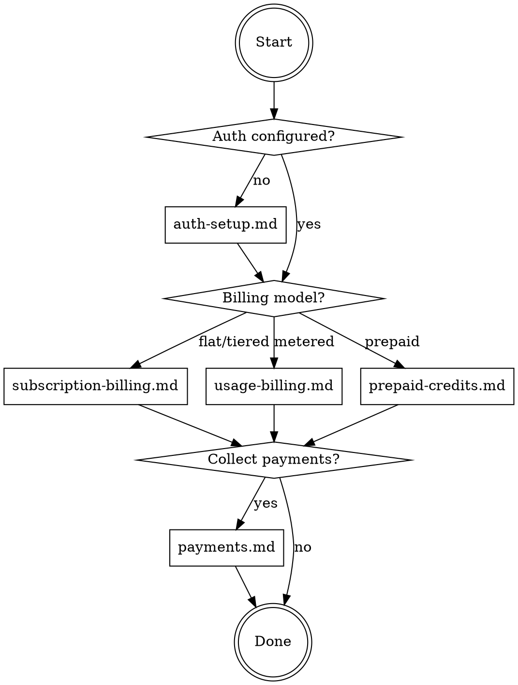

# EasyBilling Integration

EasyBilling is a multi-tenant billing platform with subscription, usage-based, and prepaid credit models. This skill guides you through integrating a customer's application with its REST API.

## Domain Model

```
Account (billing identity — everything hangs off accountNumber)
  ├── Contract → ContractSegment (subscription, immutable snapshots)
  ├── Bucket (prepaid credit pool — resource or currency based)
  ├── UsageEvent (metered consumption data)
  └── Invoice (read-only — generated by billing engine)
Plan → PlanItem (catalog: pricing tables, tiers, discounts)
PaymentHub (separate: transactions, refunds, gateways)
```

Read domain-model.md for full entity relationships, lifecycle states, and ID formats.

## What Does the Customer Need?



Ask the customer which billing model they need. Multiple models can be combined (e.g., subscription + usage metering on the same account).

## Common Mistakes

- **Trying to create invoices** — Invoices are read-only. The billing engine generates them from contracts and usage events.
- **Skipping account creation** — Every operation requires an `accountNumber`. Create the account first.
- **Using `create-contract-with-plan` for prepaid credits** — Use `create-contract-with-plan-item` instead. They are different action types.
- **Forgetting HTTPS for Stripe URLs** — `paymentSuccessUrl` and `paymentCancelUrl` must start with `https://` for Stripe.
- **Sending > 50 usage events** — The ingestion endpoint accepts max 50 events per request. Batch accordingly.
